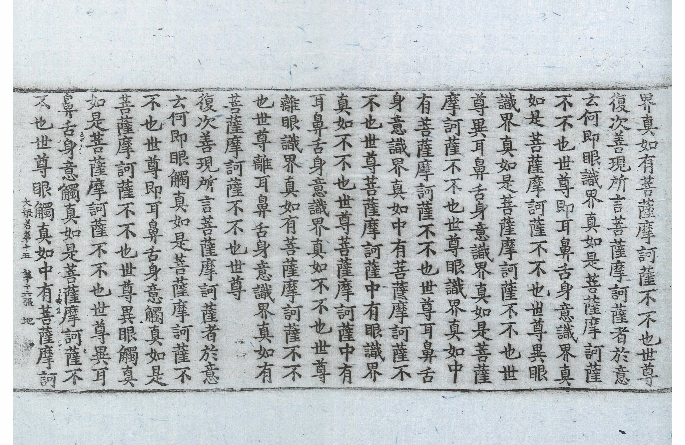

# OCR System for Chinese Historical Documents with Image-Based Reading Order Detection

**Author:** Hsing-Yuan Ma
**Affiliation:** National Chengchi University
**Contact:** [hsingyuanma@gmail.com](mailto:hsingyuanma@gmail.com)

---

## 🚀 Project Overview

This project offers an advanced Optical Character Recognition (OCR) solution specialized for **Chinese historical documents**, uniquely addressing complex layouts and reading orders. It employs state-of-the-art methods for text detection and recognition and introduces an innovative approach for image-based reading order detection, significantly improving the accuracy and usability of digitized historical texts.

## 🖼️ Sample Output

Input image:



Output with detected text, recognition results, and reading order:


---

## 🏆 Key Features

* **Text Detection:** Leveraging Differential Binarization++ (DB++)
* **Text Recognition:** High accuracy with SVTR Net
* **Reading Order Detection:** CNN-based approach combining visual and spatial information, utilizing the "First Decide then Decode" (FDTD) algorithm
* **Visualized Outputs:** Interactive annotations with bounding boxes, recognized texts, and reading order indicators
* **Dockerized Deployment:** Easily deployable using Docker and accessible via a modern Gradio interface

---

## 📚 System Pipeline

1. **Input:** Upload historical document images.
2. **Text Detection:** Segments text regions using DB++.
3. **Text Recognition:** Identifies text content using SVTR Net.
4. **Reading Order Detection:** Determines reading sequence using multimodal CNN model.
5. **Output:** Structured digital text with annotated visualizations.

---

## 🧑‍🔬 Model Training

* **Datasets:** MTHv2 (Tripitaka Koreana in Han, Multiple Tripitaka in Han; \~3,199 images)
* **Performance Metrics:**

  * **Text Detection:** F1 score = 0.95
  * **Text Recognition:** Accuracy = 0.83
  * **Reading Order Detection:** Page Error Rate of 5%, meaning that only 5% of pages contain any order prediction errors (i.e., at least one text box is placed in an incorrect sequence).

---

## 🛠️ Getting Started

### 📌 Requirements

* Docker
* CUDA-enabled GPU

### 🐳 Deployment Using Docker

#### 1. **Clone Repository**

```bash
git clone https://github.com/Polo-Marco/HanDoc-OrderOCR.git
cd HanDoc-OrderOCR
```

#### 2. **Build Docker Image**

```bash
docker build -t chinese-historical-ocr .
```

#### 3. **Run Docker Container**

```bash
docker run --gpus all --shm-size 8g -p 9999:9999 chinese-historical-ocr
```

### 🌐 Access the Application

* Open your browser at: `http://localhost:9999`

---

## 🏗️ Project Structure

```
.
├── app/                 # Main application code (main.py, pipeline, utils)
├── models/              # Model weights
├── scripts/             # Utility scripts
├── assets/              # Demo result
├── output/              # Output files and temporary data
├── PaddleOCR/           # PaddleOCR library
├── VORO/                # Reading order detection module
├── Dockerfile           # Docker configuration
├── requirements.txt     # Python dependencies
└── README.md
```

---

## 📖 References

* **Paper:** [Reading between the Lines: Image-Based Order Detection in OCR for Chinese Historical Documents](https://ojs.aaai.org/index.php/AAAI/article/view/30572) *(Ma, Huang, Liu - AAAI 2024)*
* **Methods and Algorithms:**

  * DB++ *(Liao et al., 2022)*
  * SVTR Net *(Du et al., 2022)*
  * FDTD algorithm *(Quiros & Vidal, 2022)*

---

## 🙏 Acknowledgements

Supported by National Chengchi University and Academia Sinica. Thanks to the open-source OCR community.

---

## 📢 License

Copyright © 2024
Association for the Advancement of Artificial Intelligence (AAAI)
Open-source for academic and research use.

---

## ✨ Contact

For collaboration, deployment assistance, or inquiries, contact [hsingyuanma@gmail.com](mailto:hsingyuanma@gmail.com).

---

*This project helps preserve and unlock the cultural heritage of Chinese manuscripts, making historical documents accessible for research and exploration.*
